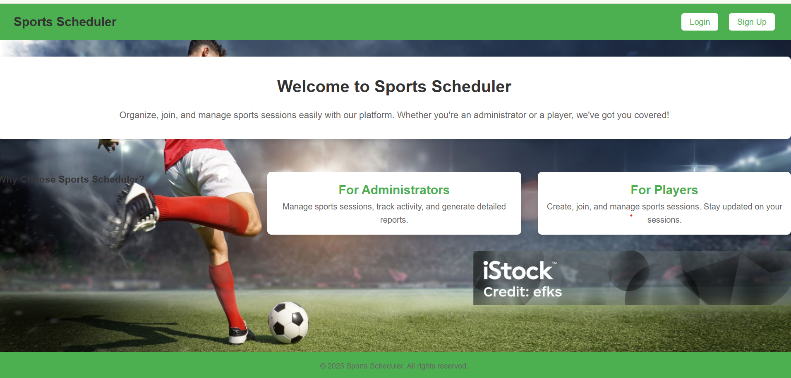
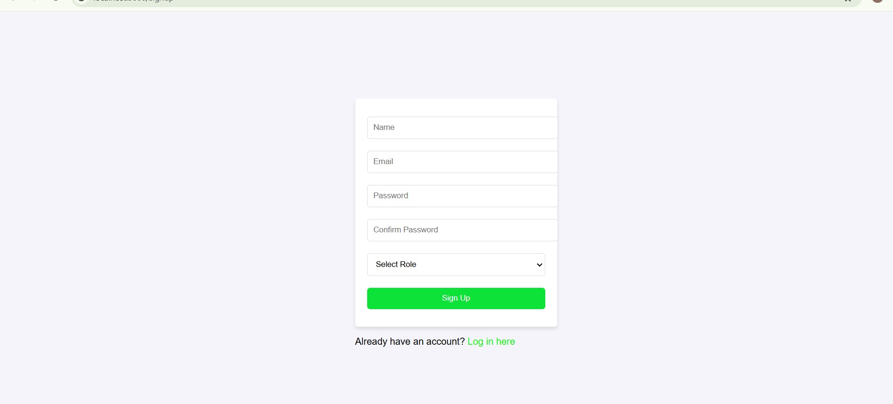
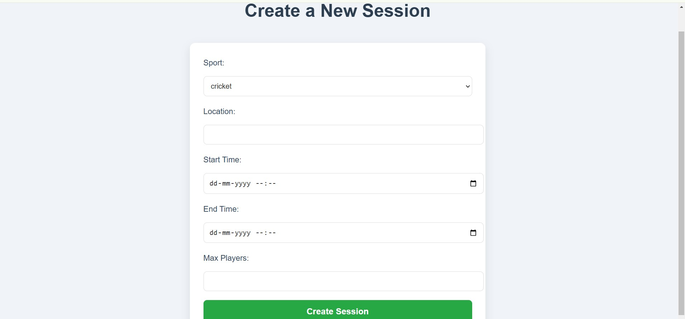
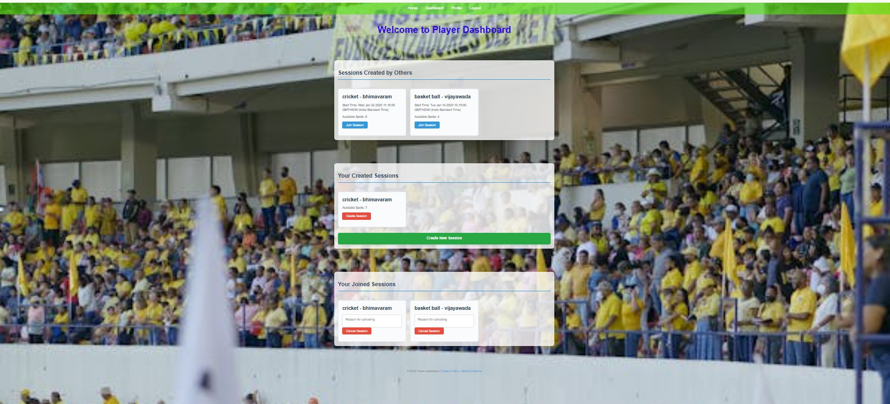

# **Sports Scheduler**

## **Overview**
**Sports Scheduler** is my capstone project for Full Stack Web Development. It is a full-stack web application built using **Express.js**, **Node.js**, and **PostgreSQL**. The application provides a platform for administrators to create and manage sports and for participants to create and join sports sessions.

This project showcases my ability to build secure, user-friendly, and dynamic web applications with a robust backend and an interactive frontend.

---

## **Features**

### **Administrator Functions**
- Create, edit, and delete sports.
- Manage sports sessions created by participants.
- View detailed reports on session popularity and activity trends.

### **Participant Functions**
- Sign up and log in securely.
- Create new sports sessions, including team details, venue, date, and time.
- View upcoming and past sessions.
- Join available sessions and cancel their own sessions with reasons.

---

## **Screenshots**

### Homepage

### Signup Page

### Creating a New Sport

### Session Details

## **Live Application**
Check out the live version of the application: [Sports Scheduler Live URL](https://sports-scheduler-phej.onrender.com)  

### **Watch the YouTube Presentation**
Check out the project presentation on YouTube:  

